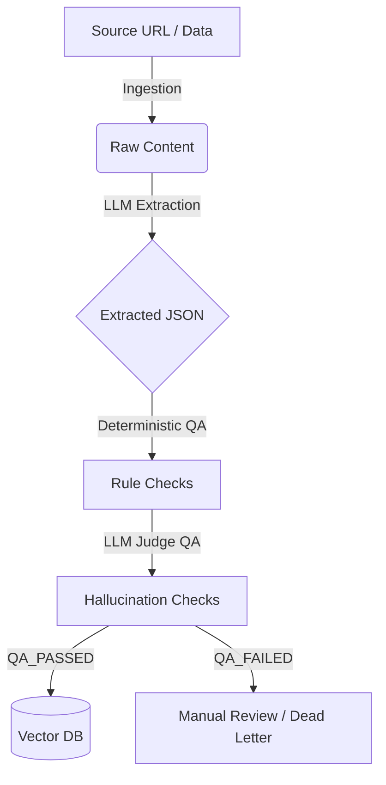

# DataForge

**DataForge** is a generic, domain-agnostic AI data pipeline engine designed to orchestrate complex data ingestion, structured extraction, quality assurance (QA), and vectorization tasks.

Built on top of **Temporal**, DataForge ensures resilient, stateful, and idempotent workflows. It uses a configuration-driven approach (`PipelineConfig`), allowing you to adapt the engine to any domain (Legal, Financial, E-commerce, Academic, etc.) without modifying the core logic.

## 🚀 Key Features

- **Domain-Agnostic Pipeline:** Define your extraction schemas, prompts, and QA rules dynamically via YAML or DB using `PipelineConfig`.
- **Idempotent Executions:** Avoid processing duplicate data with `content_hash` tracking at the database level.
- **Robust State Machine:** Every record transitions through a strictly defined state machine (`INGESTED` -> `EXTRACTED` -> `QA_PASSED` -> `VECTORIZED`), making debugging and auditing straightforward.
- **Dual-Layer Quality Assurance (QA):**
  - *Deterministic QA:* Rule-based checks (e.g., regex, nullability).
  - *LLM Judge:* Evaluates the extracted JSON against the raw source text to detect hallucinations or semantic errors.
- **Seamless Vectorization:** Automatically format and push extracted JSON or raw text into vector databases (like `pgvector` or `Qdrant`).

## 🏗️ Architecture



### Core Components
- **`src/infrastructure/`**: Core integrations (Temporal worker, PostgreSQL models, vLLM/OpenAI clients).
- **`src/schemas/`**: Pydantic models defining `PipelineConfig`, `Record` state, and `QAResult`.
- **`src/activities/`**: Isolated Temporal activities for scraping, LLM API calls, and DB operations.
- **`src/workflows/`**: The orchestration layer. `FullPipelineWorkflow` ties everything together.

## ⚙️ Multi-Domain Configuration Examples

DataForge runs on configurations. The engine itself contains zero domain-specific logic. By simply swapping the `PipelineConfig`, you can pivot from parsing legal contracts to extracting e-commerce products or medical research papers.

### Example 1: E-Commerce Product Extraction
```yaml
name: "ecommerce_products"
version: "1.0.0"
input_type: "url"

extraction:
  schema_definition:
    type: "object"
    properties:
      product_name: { type: "string" }
      price: { type: "number" }
      in_stock: { type: "boolean" }
  prompt_template: "Extract product details from: {text}"

qa_rules:
  - rule_type: "not_null"
    field_name: "product_name"
  - rule_type: "llm_judge"
    llm_prompt: "Check if the price matches the text. TEXT: {text} JSON: {json}"
```

### Example 2: Legal Contracts
```yaml
name: "legal_contracts"
version: "1.0.0"
input_type: "text"

extraction:
  schema_definition:
    type: "object"
    properties:
      parties: { type: "array", items: { type: "string" } }
      total_amount: { type: "number" }
  prompt_template: "Extract the parties and amount from this contract: {text}"
```

You can find more examples in the `src/configs/` directory.

## 🛠️ Getting Started

1. Clone the repository.
2. Install dependencies: `pip install -r requirements.txt`
3. Set your environment variables (`OPENAI_API_KEY`, `VLLM_API_BASE`, database connection string).
4. Run the Temporal Worker:
   ```bash
   python -m src.worker
   ```
5. Submit a workflow to the `dataforge-task-queue`.
